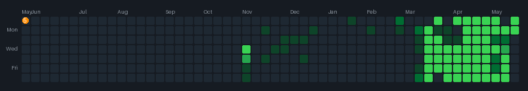
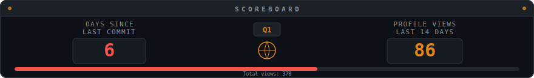
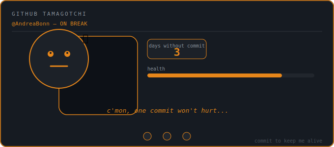
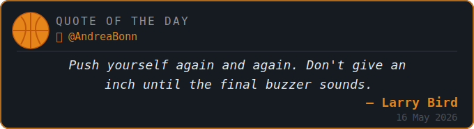
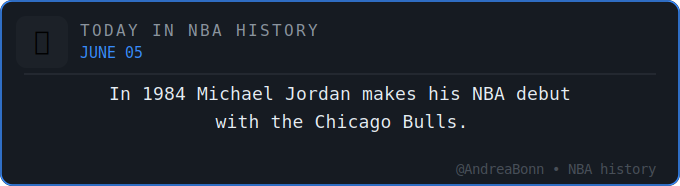

# Hey, sono Andrea 👋🏀

> *Center/Pivot sul campo. Developer fuori.*
> Scrivo codice come gioco a basket — con pazienza, precisione e qualche rimbalzo offensivo.

---

## 🐍 il serpente pivot

Il serpente **#5** percorre il mio contribution graph ogni settimana e trasforma le celle vuote in palloni da basket. La forma dipende dai miei commit reali — ogni settimana è diversa.



---

## ⏱ giorni dall'ultimo commit



---

## 🐣 il mio tamagotchi

Committo → è felice. Sparisco → soffre. Dopo 14 giorni muore e lascia un messaggio di addio.



---

## 💬 quote del giorno

*Si aggiorna ogni mattina alle 7:00 UTC.*



---

## 📅 oggi nella storia NBA



---

## 👁 visitatori


---

## 🏀 roster — i miei progetti

> *Come in una squadra, ogni progetto ha il suo ruolo.*

**Starting Five**

| # | Progetto | Ruolo | Cosa fa |
|---|----------|-------|---------|
| 5 | [**Video Anonimyzer**](https://github.com/AndreaBonn/video-anonimyzer) | Center | Anonimizzazione automatica persone in video sorveglianza. YOLO v8 + ByteTrack |
| 4 | [**RoomMates**](https://github.com/AndreaBonn/RoomMatesByBonn) | Power Forward | Gestione coinquilini — spese condivise, pulizie con AI, lista spesa real-time. React + Firebase |
| 3 | [**LifeTrack**](https://github.com/AndreaBonn/LifeTrackByBonn) | Small Forward | Tracking salute personale — peso, sonno, calorie, parametri vitali. PWA con Google Fit e Telegram |
| 2 | [**Budgee**](https://github.com/AndreaBonn/BudgeeByBonn) | Shooting Guard | Finanze personali — spese, budget, investimenti con grafici interattivi. Installabile, cloud-sync, offline |
| 1 | [**text-to-speech**](https://github.com/AndreaBonn/text-to-speech) | Point Guard | Converti documenti in audio ITA/ENG — 5 voci neurali, supporto MD/EPUB/PDF/DOCX |

**Dalla panchina**

| Progetto | Cosa fa |
|----------|---------|
| [**web-article-summarizer**](https://github.com/AndreaBonn/web-article-summarizer) | Riassumi articoli web e PDF con AI — Groq, OpenAI, Claude, Gemini |
| [**audio-filename-fixer**](https://github.com/AndreaBonn/audio-filename-fixer) | Tag e rinomina automatica file audio via AcoustID + MusicBrainz |
| [**nautilus-extensions**](https://github.com/AndreaBonn/nautilus-extensions) | Superpoteri per Nautilus — preview dati, merge PDF, analisi Dockerfile |
| [**cli-image-paste**](https://github.com/AndreaBonn/cli-image-paste) | Incolla immagini dalla clipboard nel terminale — perfetto per AI assistants |
| [**download-organizer**](https://github.com/AndreaBonn/download-organizer) | Organizza automaticamente la cartella Downloads per tipo di file |
| [**dipendenti-in-cloud**](https://github.com/AndreaBonn/dipendenti-in-cloud-notifier) | Estensione Chrome — reminder timbratura su dipendentincloud.it |
| [**AutoGPS**](https://github.com/AndreaBonn/AutoGPS-by-Bonn) | GPS automatico in auto via Bluetooth/Android Auto. Zero cloud, zero tracking |
| [**CV interattivo**](https://github.com/AndreaBonn/AndreaBonn.github.io) | Portfolio e CV con GitHub Pages e PDF scaricabile |

---

## 🛠 stack

```
linguaggi      Python · JavaScript · TypeScript · Shell · SQL
framework      React · FastAPI · Firebase · Telegram Bot API
AI/ML          YOLO · Scikit-learn · Pandas · Polars
tool           Git · GitHub Actions · Docker · Claude Code
interessi      basket · open source · automazione · AI
```

---

## 📬 contatti

[](https://linkedin.com/in/andreabonn)
[](https://github.com/AndreaBonn)

---

<details>
<summary>⚙️ come funziona questo profilo</summary>

Tutto è automatizzato con **GitHub Actions** — un workflow gira ogni mattina alle 7:00 UTC e aggiorna tutti gli asset:

| Widget | Script | Frequenza |
|--------|--------|-----------|
| Snake Basket | `scripts/snake_basket.py` | ogni lunedì |
| Quote del giorno | `scripts/quote_basket.py` | ogni giorno |
| Oggi nella storia NBA | `scripts/nba_today.py` | ogni giorno |
| Tamagotchi | `scripts/tamagotchi.py` | ogni giorno |
| Ultimo commit | `scripts/tamagotchi.py` | ogni giorno |

Per usarlo nel tuo profilo: crea un repo con lo stesso nome del tuo username, aggiungi un secret `SNAKE_TOKEN` con un GitHub Personal Access Token (permessi `read:user` e `public_repo`) e abilita il workflow.

</details>

---

*Il README si aggiorna da solo. Come un buon pivot sotto canestro.*
