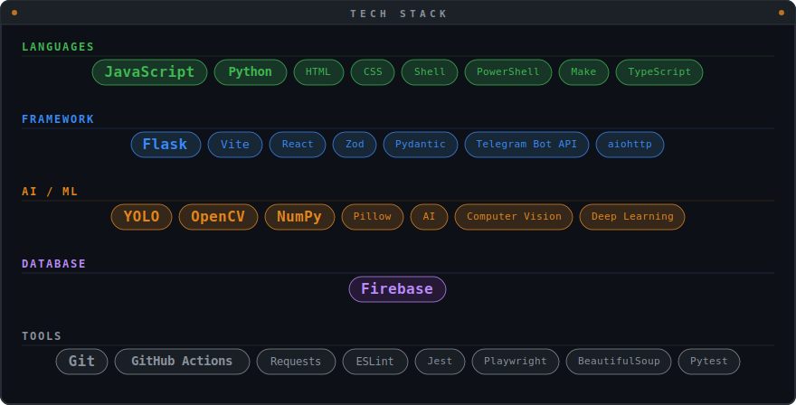

<h1>Andrea Bonacci </h1>

AI Engineer · Data Analyst

> Life is all about *one-shot learning*: one example for the prompt, one shot for the basket.

---

---

---

<table>
<tr>
<td width="50%">

</td>
<td width="50%">

</td>
</tr>
</table>

---

| Project                                                                               | What it does                                                                                               | Tests | Coverage | Stars                                                                                                          |
| ------------------------------------------------------------------------------------- | ---------------------------------------------------------------------------------------------------------- |:-----:|:--------:|:--------------------------------------------------------------------------------------------------------------:|
| [**Video Anonimyzer**](https://github.com/AndreaBonn/video-anonimyzer)                | Automatic person anonymization in surveillance video. YOLO v8 + ByteTrack                                  |  |  |              |
| [**web-article-summarizer**](https://github.com/AndreaBonn/web-article-summarizer)    | Web and PDF article summaries via Groq, OpenAI, Claude, Gemini                                             |  |  |        |
| [**ai-pr-reviewer**](https://github.com/AndreaBonn/ai-pr-reviewer)                    | AI-powered PR code review as a [GitHub Action](https://github.com/marketplace/actions/ai-pr-reviewer-by-bonn). Supports Groq, Gemini, Anthropic, OpenAI |  |  |  |
| [**text-to-speech**](https://github.com/AndreaBonn/text-to-speech)                    | Converts documents to ITA/ENG audio with 5 neural voices. Supports MD, EPUB, PDF, DOCX                     |  |  |                |
| [**Budgee**](https://github.com/AndreaBonn/BudgeeByBonn)                              | Personal finance: expenses, budgets, investments with interactive charts. Installable, cloud-sync, offline | | |                  |
| [**BetTracker**](https://github.com/AndreaBonn/BetTracker-by-Bonn)                    | Sports bet tracker with AI-powered OCR and auto-results via Gemini. PWA, stats, virtual mode               | | |            |
| [**AutoGPS**](https://github.com/AndreaBonn/AutoGPS-by-Bonn)                          | Auto-start GPS in car via Bluetooth/Android Auto. No cloud, no tracking                                    | | |               |
| [**LifeTrack**](https://github.com/AndreaBonn/LifeTrackByBonn)                        | Personal health tracking: weight, sleep, calories, vitals. PWA with Google Fit and Telegram                | | |               |
| [**RoomMates**](https://github.com/AndreaBonn/RoomMatesByBonn)                        | Roommate management: shared expenses, AI-powered chores, real-time grocery list. React + Firebase          | | |               |
| [**remote-terminal-bot**](https://github.com/AndreaBonn/remote-terminal-bot)          | Remote shell via Telegram: persistent sessions, multi-machine switching, no VPN needed                     |  |  |           |
| [**cli-image-paste**](https://github.com/AndreaBonn/cli-image-paste)                  | Paste images from clipboard into the terminal, handy with AI assistants                                    | | |               |
| [**audio-filename-fixer**](https://github.com/AndreaBonn/audio-filename-fixer)        | Auto-tag and rename audio files via AcoustID + MusicBrainz                                                 |  |  |          |
| [**nautilus-extensions**](https://github.com/AndreaBonn/nautilus-extensions)          | Nautilus extensions: data preview, PDF merge, Dockerfile analysis                                          |  |  |           |
| [**download-organizer**](https://github.com/AndreaBonn/download-organizer)            | Sorts the Downloads folder by file type, every 3 hours                                                     | | |            |
| [**dipendenti-in-cloud**](https://github.com/AndreaBonn/dipendenti-in-cloud-notifier) | Chrome extension to never forget clocking in on dipendentincloud.it                                        |  |  |  |
| [**Interactive CV**](https://github.com/AndreaBonn/AndreaBonn.github.io)              | Portfolio and CV on GitHub Pages                                                                           | | |          |

---

### 

---

### 

              

<!-- profile view tracker (komarev) — incrementa ad ogni visita al profilo -->

